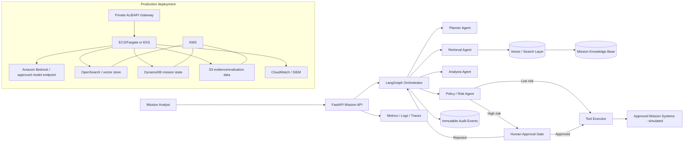
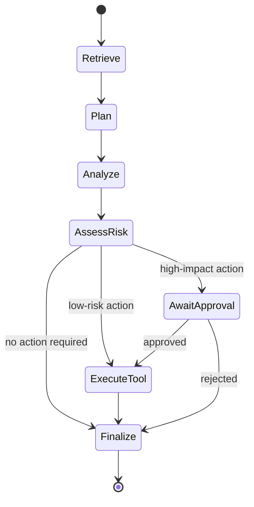

# Agentic Government Mission Copilot

A portfolio-grade reference implementation for building and operating agentic AI systems in high-stakes U.S. Government environments.

> **Demo only.** This repository contains synthetic data and simulated actions. It is not authorized for operational government use and is intentionally designed so high-impact actions require explicit human approval.

## Why this project exists

This project demonstrates the capabilities commonly expected from an Agentic AI / Forward Deployed / Applied AI Engineer working with government partners:

- LLM applications with multi-agent orchestration
- Retrieval-Augmented Generation (RAG) with grounded citations
- Tool-calling agents
- Human-in-the-loop approval for high-impact actions
- Context and mission-state management
- Evaluation and red-team style test cases
- Auditability, observability, and security controls
- Infrastructure-as-Code for a production deployment pattern
- Clear communication of technical behavior to mission stakeholders

## Mission scenario

The synthetic scenario is a **Mission Operations Copilot** supporting an emergency-management coordination cell. An analyst can ask:

> "Summarize the current situation in Sector 7, identify the highest-priority operational risk, and prepare a resource-allocation request if action is warranted."

The system:

1. Retrieves relevant synthetic mission reports.
2. Builds an evidence-grounded situation summary.
3. Uses a planner agent to determine whether more information or an operational action is needed.
4. Uses a policy/risk agent to classify the proposed action.
5. Routes high-impact actions to a human approval gate.
6. Calls a simulated mission tool only after approval.
7. Writes a complete audit trail for every model, retrieval, policy, and tool event.

## Architecture



## Agent workflow



## Repository layout

```text
app/
  main.py                    FastAPI service
  agents/orchestrator.py     LangGraph workflow
  services/llm.py            Model-provider abstraction
  services/rag.py            Lightweight RAG implementation
  services/audit.py          Structured audit events
  services/policy.py         High-impact action policy checks
  tools/mission_tools.py     Simulated tool calls
  models/schemas.py          API and state models

evals/
  mission_eval.jsonl         Synthetic evaluation set
  run_eval.py                Automated quality / safety checks

infra/aws/
  main.tf                    Secure AWS reference deployment
  variables.tf
  outputs.tf

docs/
  SECURITY.md                Security and authorization model
  EVALUATION.md              Evaluation strategy
  STAKEHOLDER_BRIEF.md       Non-technical mission briefing
  PRODUCTION_READINESS.md    POC-to-production checklist
```

## Quick start

### 1. Create a virtual environment

```bash
python -m venv .venv
source .venv/bin/activate
pip install -r requirements.txt
```

### 2. Configure environment

```bash
cp .env.example .env
```

You can run the demo in deterministic local mode with no external model key. To use a model provider, configure the provider-specific variables in `.env`.

### 3. Run the API

```bash
uvicorn app.main:app --reload
```

### 4. Try a mission request

```bash
curl -X POST http://127.0.0.1:8000/mission/run \
  -H 'Content-Type: application/json' \
  -d '{
    "request": "Summarize Sector 7 and prepare a resource allocation request if required.",
    "user_id": "analyst.demo",
    "role": "mission_analyst"
  }'
```

If the workflow proposes a high-impact action, the response returns an `approval_id` rather than executing it.

### 5. Approve a pending action

```bash
curl -X POST http://127.0.0.1:8000/mission/approve \
  -H 'Content-Type: application/json' \
  -d '{
    "approval_id": "<approval-id>",
    "approver_id": "supervisor.demo",
    "decision": "approved",
    "comment": "Validated against current mission priorities."
  }'
```

## Example output

```json
{
  "status": "awaiting_human_approval",
  "summary": "Sector 7 shows a sustained communications outage affecting two response teams...",
  "evidence": [
    {"source": "sector7_sitrep_001.txt", "score": 0.82},
    {"source": "sector7_logistics_002.txt", "score": 0.71}
  ],
  "proposed_action": {
    "tool": "request_resource_allocation",
    "arguments": {"resource": "mobile communications unit", "quantity": 1}
  },
  "approval_id": "..."
}
```

## Evaluation

```bash
python evals/run_eval.py
```

The evaluator checks:

- Retrieval relevance
- Presence of evidence references
- Refusal to invent unsupported mission facts
- Human-approval enforcement for high-impact actions
- Tool-call schema correctness
- Audit-event creation

## Security principles demonstrated

- Private-first deployment pattern
- No autonomous execution of high-impact tools
- Least-privilege IAM and separate execution roles
- Structured authorization boundary before tool execution
- KMS encryption for state, evidence, and audit data
- Central logging for model/tool/user events
- Synthetic data only in this public repository
- No secrets in source control
- Model provider is abstracted so an agency-approved endpoint can be substituted

## How this maps to an Agentic AI Engineer job description

| Requirement | Project evidence |
|---|---|
| Architect and ship agentic AI systems | End-to-end API, orchestration, tools, approval gates, IaC |
| Multi-agent frameworks | LangGraph planner, retriever, analyst, risk-policy workflow |
| Tool calling | Typed simulated mission operations tools |
| RAG | Evidence retrieval + grounded response generation |
| Human-in-the-loop autonomy | Mandatory approval for high-impact actions |
| Data curation and evaluation | Synthetic knowledge base + JSONL eval suite |
| Model inference infrastructure | Provider abstraction + AWS Bedrock deployment pattern |
| Production lifecycle ownership | Security, observability, Terraform, readiness checklist |
| Government stakeholder communication | `docs/STAKEHOLDER_BRIEF.md` |
| Context management | Mission state object persisted through orchestration |

