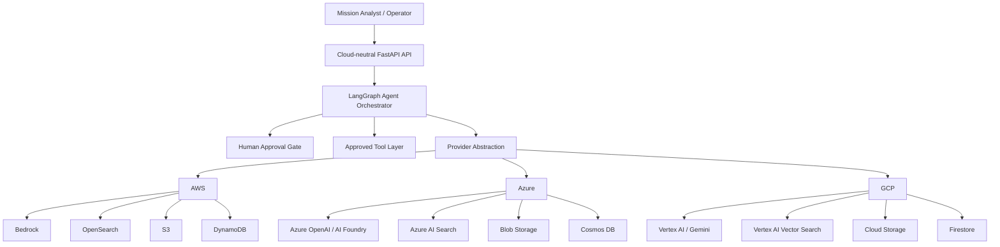

# Multi-Cloud Agentic AI Architecture

This project uses one cloud-neutral mission application and multiple provider adapters.

## Common application plane

The following components remain the same across clouds:

- FastAPI service
- LangGraph orchestration
- Planner / retrieval / analysis / policy workflow
- Tool schemas
- Human-in-the-loop approval controls
- Evaluation framework
- Audit event model
- Mission-state contract

## Cloud service mapping

| Capability | AWS | Azure | GCP |
|---|---|---|---|
| LLM / frontier model | Amazon Bedrock | Azure OpenAI / Azure AI Foundry | Vertex AI / Gemini |
| Vector / search | OpenSearch | Azure AI Search | Vertex AI Vector Search |
| Object storage | S3 | Blob Storage | Cloud Storage |
| Mission state | DynamoDB | Cosmos DB | Firestore |
| Container platform | ECS/EKS | Container Apps/AKS | Cloud Run/GKE |
| Secrets | Secrets Manager | Key Vault | Secret Manager |
| Key management | KMS | Key Vault / Managed HSM | Cloud KMS |
| Observability | CloudWatch | Azure Monitor / App Insights | Cloud Logging / Monitoring |
| SIEM / security | Security Hub + SIEM | Defender for Cloud / Sentinel | Security Command Center |

## Architecture

## Design principle

Do not fork the business logic into three different applications. Keep the mission workflow and safety controls cloud-neutral, and swap only the provider-specific implementations.

## Government deployment note

Service availability differs across AWS GovCloud, Azure Government, and Google government/regulated offerings. Treat the mappings above as a reference architecture and validate:

- model availability
- region eligibility
- FedRAMP authorization boundary
- private networking support
- logging and retention requirements
- data residency
- cross-boundary connectivity
- identity integration

before any production deployment.
